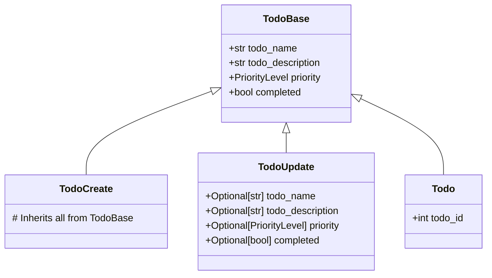
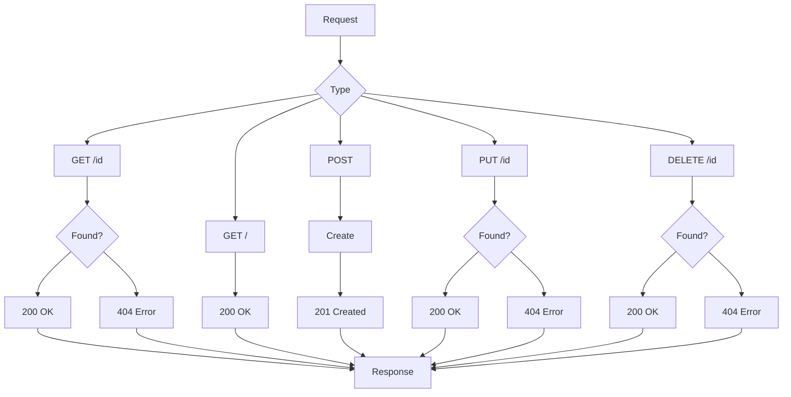

# FastAPI Comprehensive Guide & TODO Application Documentation

## Table of Contents
1. [Introduction to FastAPI](#introduction-to-fastapi)
2. [Libraries and Their Importance](#libraries-and-their-importance)
3. [Class-Based Approach vs Traditional](#class-based-approach-vs-traditional)
4. [Routing in FastAPI](#routing-in-fastapi)
5. [Data Models and Schema](#data-models-and-schema)
6. [API Endpoints Documentation](#api-endpoints-documentation)
7. [Workflow and Flowchart](#workflow-and-flowchart)
8. [How to Run the Application](#how-to-run-the-application)

---

## Introduction to FastAPI

FastAPI is a modern, high-performance web framework for building APIs with Python 3.6+ based on standard Python type hints. It's designed for:
- **High performance**: Comparable to NodeJS and Go
- **Fast development**: Increase development speed by 200-300%
- **Fewer bugs**: Reduce about 40% of human-induced errors
- **Intuitive**: Great editor support and completion
- **Easy**: Designed to be easy to use and learn

## Libraries and Their Importance

### 1. **FastAPI** (`from fastapi import FastAPI`)
- **Purpose**: Main framework for building the API
- **Importance**: Provides routing, dependency injection, middleware, and automatic documentation
- **Key Features**: Automatic OpenAPI documentation, data validation, serialization

### 2. **Pydantic** (`from pydantic import BaseModel, Field`)
- **Purpose**: Data validation and settings management using Python type annotations
- **Importance**:
  - **Data Validation**: Ensures incoming data matches expected types and constraints
  - **Serialization**: Converts Python objects to JSON and vice-versa
  - **Field Validation**: Using `Field()` for additional constraints (min/max length, descriptions)

### 3. **Typing** (`from typing import List, Optional`)
- **Purpose**: Type hints for better code readability and validation
- **Importance**:
  - **`List[Todo]`**: Specifies API returns a list of Todo objects
  - **`Optional[str]`**: Indicates a field can be string or None
  - **Better IDE support** and error detection

### 4. **Enum** (`from enum import IntEnum`)
- **Purpose**: Create enumerated constants
- **Importance**:
  - **`PriorityLevel`**: Ensures only valid priority values are accepted
  - **Type Safety**: Prevents invalid values
  - **Readability**: `PriorityLevel.HIGH` vs magic number `1`

### 5. **HTTPException** (`from fastapi import HTTPException`)
- **Purpose**: Proper error handling with HTTP status codes
- **Importance**: Returns structured error responses instead of generic errors

## Class-Based Approach vs Traditional

### Why Use Classes?
```python
# Traditional Approach (Problems)
@api.post('/todo')
def create_todo(todo: dict):  # No validation
    # Manual validation needed
    # No type safety
    # Error-prone

# Class-Based Approach (Better)
class TodoCreate(BaseModel):
    todo_name: str = Field(..., min_length=2)
    
@api.post('/todo', response_model=Todo)
def create_todo(todo: TodoCreate):  # Automatic validation
    # Type-safe
    # Auto-documentation
    # Less error-prone
```

### Benefits of Class-Based Approach:
1. **Data Validation**: Automatic validation of request/response data
2. **Auto-Documentation**: FastAPI generates API documentation automatically
3. **Type Safety**: Catch errors at development time
4. **Serialization**: Automatic JSON conversion
5. **Code Reusability**: Models can be reused across endpoints

## Routing in FastAPI

### What is Routing?
Routing is the mechanism that maps HTTP requests to specific handler functions based on the URL path and HTTP method.

### How Routing Works:
```python
@api.get('/todo/{todo_id}')      # GET /todo/1
@api.post('/todo')               # POST /todo  
@api.put('/todo/{todo_id}')      # PUT /todo/1
@api.delete('/todo/{todo_id}')   # DELETE /todo/1
```

### Path Parameters vs Query Parameters:
```python
# Path Parameter - part of URL path
@api.get('/todo/{todo_id}')      # /todo/123

# Query Parameter - after ? in URL  
@api.get('/todo')                # /todo?first_n=3
def get_todo(first_n: int = 3):  # Optional parameter with default
```

## Data Models and Schema

### Model Hierarchy:


### Model Definitions:
```python
class TodoBase(BaseModel):
    # Field() provides validation and documentation
    todo_name: str = Field(..., min_length=2, max_length=150)
    todo_description: str = Field(..., max_length=300)
    priority: PriorityLevel = Field(default=PriorityLevel.LOW)
    completed: bool = Field(default=False)

class TodoCreate(TodoBase):
    pass  # Same as base, used for creation

class TodoUpdate(TodoBase):
    # All fields optional for partial updates
    todo_name: Optional[str] = None
    todo_description: Optional[str] = None
    priority: Optional[PriorityLevel] = None  
    completed: Optional[bool] = None

class Todo(TodoBase):
    todo_id: int  # Includes ID for response
```

## API Endpoints Documentation

### 1. **GET /todo/{todo_id}**
- **Purpose**: Retrieve a specific todo by ID
- **Parameters**: `todo_id` (path parameter)
- **Response**: `Todo` object or 404 error
- **Example**: `GET /todo/1`

### 2. **GET /todo**
- **Purpose**: Retrieve todos with optional limit
- **Parameters**: `first_n` (query parameter, optional)
- **Response**: List of `Todo` objects
- **Example**: `GET /todo?first_n=3`

### 3. **POST /todo** 
- **Purpose**: Create a new todo
- **Request Body**: `TodoCreate` object
- **Response**: Created `Todo` object
- **Example**: `POST /todo` with JSON body

### 4. **PUT /todo/{todo_id}**
- **Purpose**: Update an existing todo
- **Parameters**: `todo_id` (path parameter)
- **Request Body**: `TodoUpdate` object (partial updates supported)
- **Response**: Updated `Todo` object
- **Example**: `PUT /todo/1` with JSON body

### 5. **DELETE /todo/{todo_id}**
- **Purpose**: Delete a todo
- **Parameters**: `todo_id` (path parameter)  
- **Response**: Success message and deleted todo
- **Example**: `DELETE /todo/1`

## Workflow and Flowchart

### Application Flow:



### Data Flow:
1. **Request Received** → FastAPI router
2. **Path/Query Parameters** → Extracted and validated
3. **Request Body** → Parsed and validated by Pydantic model
4. **Business Logic** → Your handler function executes
5. **Response Model** → Data validated and serialized to JSON
6. **HTTP Response** → Sent back to client

## How to Run the Application

### Prerequisites:
```bash
pip install fastapi uvicorn
```

### Method 1: Basic Way (Production)
```bash
uvicorn main:api --reload
```
- `main`: Python file name (without .py)
- `api`: FastAPI instance variable name
- `--reload`: Enable auto-reload during development

### Method 2: Optimized Way (Development)
```bash
fastapi dev main.py
```
- Requires: `pip install fastapi[dev]`
- Better development experience with hot reload

### Access Points:
- **API**: http://localhost:8000
- **Interactive Documentation**: http://localhost:8000/docs (Swagger UI)
- **Alternative Documentation**: http://localhost:8000/redoc

### Testing the API:

#### Using curl:
```bash
# Get all todos (limited to 3)
curl http://localhost:8000/todo

# Get specific todo
curl http://localhost:8000/todo/1

# Create new todo
curl -X POST http://localhost:8000/todo \
  -H "Content-Type: application/json" \
  -d '{
    "todo_name": "Learn FastAPI",
    "todo_description": "Complete the tutorial",
    "priority": "HIGH",
    "completed": false
  }'

# Update todo
curl -X PUT http://localhost:8000/todo/1 \
  -H "Content-Type: application/json" \
  -d '{"completed": true}'

# Delete todo
curl -X DELETE http://localhost:8000/todo/1
```

#### Using Python requests:
```python
import requests

# Create todo
response = requests.post("http://localhost:8000/todo", json={
    "todo_name": "Test Task",
    "todo_description": "Test description",
    "priority": "MEDIUM",
    "completed": False
})
print(response.json())
```

## Key Features Demonstrated

### 1. **Automatic API Documentation**
- Visit `/docs` for interactive Swagger UI
- All endpoints, parameters, and models documented automatically
- Try-out functionality built-in

### 2. **Data Validation**
- Field constraints enforced automatically
- Type checking with meaningful error messages
- Custom validation through Pydantic

### 3. **Error Handling**
- Proper HTTP status codes (200, 201, 404)
- Structured error responses
- Custom exception handling

### 4. **RESTful Design**
- Standard HTTP methods (GET, POST, PUT, DELETE)
- Resource-based URL structure
- Proper status codes and responses

This TODO application demonstrates best practices for building robust, maintainable, and well-documented APIs with FastAPI!
